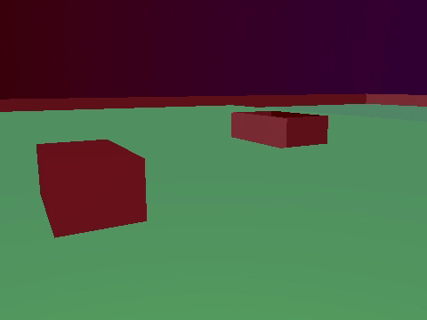

## Slicing 4D raytracer

A small 4D raytracer of the slicing kind —
meaning that it shows you a small 3D slice of a 4D world.
The gimmick of this raytracer is that it's entirely in first person.
You can rotate on the WY plane
so that you can turn the camera to look towards the fourth dimension.

Concerning what you can do in it,
you can sort of fly around and look at some hypercuboids and hyperspheres.
There's also a little fenced area and a little house to find.
The most interesting part is definitely rotating on the
WY plane, so make sure to do that a lot.

In technical terms,
rotating on the WY plane more or less replaces the world's Y axis with
the W axis in the visualization.
When the WY rotation is above 180° the world is mirrored,
so generally the interesting range of WY rotation is below 180°.

### Explanation

To understand what's going on a bit better,
you should firstly understand that
trying to draw a 4D space on a 2D computer screen is as difficult
as turn a 3D room into a 1D drawing.
On a 1D drawing, colors can only be different horizontally and not vertically
— or the other way around,
the important thing is that there is only one dimension.
This means that you can show that objects are to the left or
to the right of other objects, but you can't show that objects are above or
below other objects,
which doesn't make it very easy to show the whole room in the
drawing.
If you were to make a 1D drawing of a room, what you would probably end up
doing is essentially drawing a flat slice of the room.
This is essentially like taking a photograph of the room, and then cutting away
almost the whole picture except a very thin horizontal sliver in the middle.
You would be left with an (almost) 1D slice of the photo.


*Here's an example of that, but I stretched the 1D image vertically so you can
actually see it slightly.* 

Imagine if a computer drew a such a 1D slice for you,
fifty times a second, and then you would have to navigate the room with those
computer drawings.
A 1D slice doesn't show that much of the room, so this would certainly be very
difficult.
This raytracer is using a somewhat similar technique,
but instead of turning a 3D room
into a 1D drawing, we're turning a 4D room into a 2D drawing.
Just like a 3D room is difficult to navigate with only 1D drawings,
a 4D room is difficult to navigate with only 2D drawings.

It's important to understand that you're only ever seeing a very thin slice of
the 4D room.
This thin slice of the room that you're seeing is actually 3D —
your computer
screen is a 2D surface with width and height, and the third dimension is depth,
which is implied in the 2D picture you're seeing (humans are used to seeing
2D pictures of 3D spaces because that's how our eyes work).
Because the program only shows you a 3D slice of the 4D world,
there's always a fourth dimension that you're not seeing.
Depending on your WY rotation, this fourth dimension you're not seeing is either
W or Y.

When you start the program, it looks just like any normal 3D scene, because
you're only seeing the X, Y, and Z dimensions (for those less mathematical:
those are the normal three dimensions that you can always see), and it's
only when you rotate on the WY plane that it starts to look slightly special.
It's mostly the way the world changes as you're rotating and moving on the 4th
axis that's very special.

Because you're only seeing three out of four dimensions in this
raytracer at any given point,
it doesn't necessarily give you a very convenient overview of the 4D world.
The program contains a game (not the best game, but no less a game)
where you have to find a white hypersphere, and if you try to find
it a few times you will definitely realize that it can be quite challenging.
In truth the hypersphere usually isn't really hidden.
After the second time you find it, the hypersphere is always in mid-air
somewhere.
In a normal 3D scene you would see a white sphere immediately if it were
hovering around in mid-air,
but if you can only see a thin slice of the world at a time,
then even something in mid-air can be difficult to find.
A being with proper four-dimensional vision would be able to find the
hypersphere in an instant, because he would be able to see the entirety of the
scene.

If you rotate and move in the fourth dimension a lot, it's possible to get a
bit of a feeling for it, although it is definitely very difficult to understand.
However, because of the technique this raytracer uses, you never get a very good
overview of the 4D world no matter how much you get used to it.

Why do the spheres grow and shrink?
That's because you're looking at thin slices of a hypersphere.
To explain further,
let's first note for a moment that a circle is a round 2D shape,
a sphere is a round 3D form and a hypersphere is a round 4D form.
Just like how a paperthin slice of a sphere *(3D)* is a circle *(2D)*,
a thin slice of a hypersphere *(4D)* is a sphere *(3D)*.
If you would take a thin slice out of a sphere, the slice would be biggest if
you cut through the middle and smaller if you cut near the sides.
Similarly, the *(3D)* slice of a *(4D)* hypersphere
is biggest when you cut through
the center, and smaller when you cut near the sides.
That's why the spheres you're seeing grow and shrink — you're seeing different
slices of a hypersphere.


### What you can find

Here's a list of all the forms in the world:
- Two hard-to-miss green hypercuboids that look a bit like a grass field.
- A blue hypersphere.
- A big red hypersphere.
- A red hypercuboid with four square faces
  (two small squares and two big squares).
- A small white hypercuboid and 
  a small red hypercuboid that are touching each other.
- Two white hypercuboids that are meant to look a little bit like clouds.
- Four hyperspheres at the corners of the grass: Grey, blue, red, and green.
- A small black hypersphere that turns white when you get close.
  I made the other forms intentionally easy to find,
  but this one has arbitrary coordinates so it's a bit more challenging.
- A little fence area consisting of six red hypercuboids
- Last but not least, a tiny little house

If you're a very goal-oriented person,
I also added a thing where you get points for touching a white hypersphere.
Try finding it a couple of times. It becomes progressively more difficult.

Lost?
Press F3 to show your coordinates and
remember that you're only seeing a small sliver of 4D space,
so you may need to move on the W or the Y axis to find things back.
The blue hypersphere can be seen when Y and W are 0, so you can use that to
orient yourself.
Also helpful to know is that you start at the coordinate (0, 0, 0, 0).


### Linux installation

I didn't include the shared library dependencies with the binary release
for Linux.
Here's how to install the necessary packages
on Ubuntu or an Ubuntu-like distribution:
```shell
sudo apt install libsdl2-2.0.0 libsdl2-ttf-2.0.0
```
For other distributions, simply find and download the packages
for SDL2 and SDL2-TTF.


### Compilation

This program can be compiled with CMake.
Compilation requires the libraries SDL2 and SDL2-ttf, as well as Python 3
for a build script.

Exact steps for compiling on Debian or Ubuntu:
```shell
sudo apt install g++ cmake python3
sudo apt install libsdl2-dev libsdl2-ttf-dev
git clone https://github.com/Fruitsalad/raytracer-4d
cd ./raytracer-4d
mkdir build
cd ./build
cmake .. -DCMAKE_BUILD_TYPE=Release
cmake --build .
# Run the program:
./raytracer_4d
```


### Technical issues

At the start, the program automatically adjusts its resolution to give you
a decent refresh rate.
If the viewport is too small, you can press F3 and then repeatedly F4 to change
it.

If you have any other technical issues, please open an issue.

---
© Zowie van Dillen, 2022
